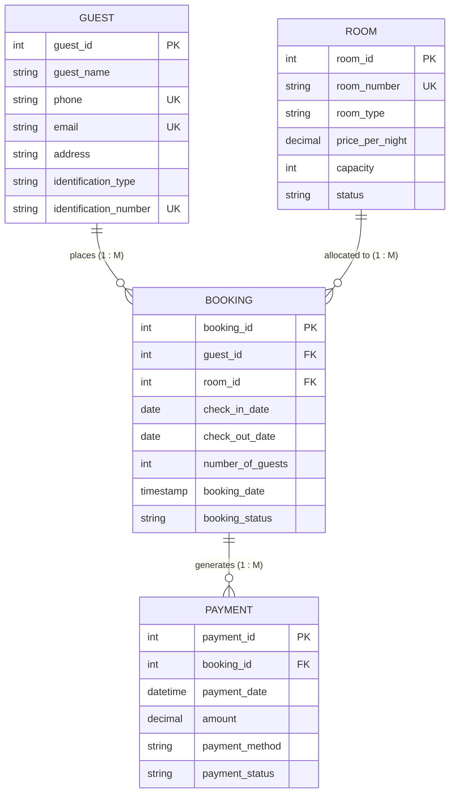

# Entity-Relationship (ER) Diagram Documentation

## 1. Executive Summary
This document defines the conceptual and logical Entity-Relationship (ER) structure for the **Hotel Booking and Rental Management System**. The database schema is strictly scoped to **4 core entities**: `GUEST`, `ROOM`, `BOOKING`, and `PAYMENT`.

---

## 2. Structural ER Diagram (Text & ASCII Notation)

```text
                 ┌─────────────────────────┐
                 │          GUEST          │
                 ├─────────────────────────┤
                 │ PK  guest_id            │
                 │     guest_name          │
                 │     phone               │
                 │     email               │
                 │     address             │
                 │     identification_type │
                 │     identification_num  │
                 └────────────┬────────────┘
                              │
                              │ 1 (One Guest)
                              │
                              │ M (Many Bookings)
                              ▼
                 ┌─────────────────────────┐
                 │         BOOKING         │
                 ├─────────────────────────┤
                 │ PK  booking_id          │
                 │ FK  guest_id            │
                 │ FK  room_id             │
                 │     check_in_date       │
                 │     check_out_date      │
                 │     number_of_guests    │
                 │     booking_date        │
                 │     booking_status      │
                 └────────────┬────────────┘
                              │
                              │ M (Many Bookings)
                              │
                              │ 1 (One Room)
                              ▼
                 ┌─────────────────────────┐
                 │          ROOM           │
                 ├─────────────────────────┤
                 │ PK  room_id             │
                 │     room_number         │
                 │     room_type           │
                 │     price_per_night     │
                 │     capacity            │
                 │     status              │
                 └─────────────────────────┘

                           BOOKING
                              │
                              │ 1 (One Booking)
                              │
                              │ M (Many Payments)
                              ▼
                 ┌─────────────────────────┐
                 │         PAYMENT         │
                 ├─────────────────────────┤
                 │ PK  payment_id          │
                 │ FK  booking_id          │
                 │     payment_date        │
                 │     amount              │
                 │     payment_method      │
                 │     payment_status      │
                 └─────────────────────────┘
```

---

## 3. Mermaid ER Diagram Visualization



---

## 4. Entity Details & Primary/Foreign Keys

### Entity 1: `GUEST`
- **Primary Key**: `guest_id`
- **Unique Attributes**: `phone`, `email`, `identification_number`
- **Description**: Represents individuals registering with the hotel for rental or room booking.
- **Relationships**:
  - One `GUEST` can place **zero, one, or many** `BOOKING`s.

### Entity 2: `ROOM`
- **Primary Key**: `room_id`
- **Unique Attributes**: `room_number`
- **Description**: Represents physical hotel units available for lodging.
- **Allowed Categories**: `'Single'`, `'Double'`, `'Deluxe'`, `'Suite'`
- **Allowed Statuses**: `'Available'`, `'Occupied'`, `'Maintenance'`
- **Relationships**:
  - One `ROOM` can be associated with **zero, one, or many** `BOOKING`s over time.

### Entity 3: `BOOKING`
- **Primary Key**: `booking_id`
- **Foreign Keys**:
  - `guest_id` → References `GUEST(guest_id)`
  - `room_id` → References `ROOM(room_id)`
- **Description**: Core associative entity recording rental contracts between guests and rooms.
- **Allowed Statuses**: `'Reserved'`, `'Checked-In'`, `'Checked-Out'`, `'Cancelled'`
- **Relationships**:
  - Many `BOOKING`s belong to **one** `GUEST`.
  - Many `BOOKING`s belong to **one** `ROOM`.
  - One `BOOKING` can have **one or many** `PAYMENT` transactions.

### Entity 4: `PAYMENT`
- **Primary Key**: `payment_id`
- **Foreign Key**:
  - `booking_id` → References `BOOKING(booking_id)`
- **Description**: Logs monetary transactions fulfilling booking billing.
- **Allowed Methods**: `'Cash'`, `'Card'`, `'UPI'`, `'Online'`
- **Allowed Statuses**: `'Paid'`, `'Pending'`, `'Failed'`, `'Refunded'`
- **Relationships**:
  - Many `PAYMENT` records belong to **one** `BOOKING`.

---

## 5. Relationship Cardinality Matrix

| Parent Entity | Child Entity | Cardinality | Participation | Description |
| :--- | :--- | :--- | :--- | :--- |
| `GUEST` | `BOOKING` | **1 : N** | Optional to Mandatory | A guest can exist without a booking, but a booking must be linked to a valid guest. |
| `ROOM` | `BOOKING` | **1 : N** | Optional to Mandatory | A room can exist without bookings, but a booking must be linked to a valid room. |
| `BOOKING` | `PAYMENT` | **1 : N** | Mandatory to Mandatory | A payment must be linked to a booking; a booking can have multiple payment attempts or installments. |
